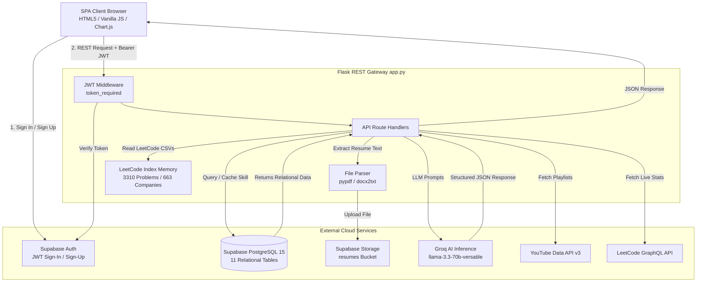
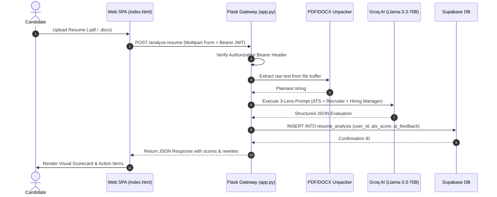
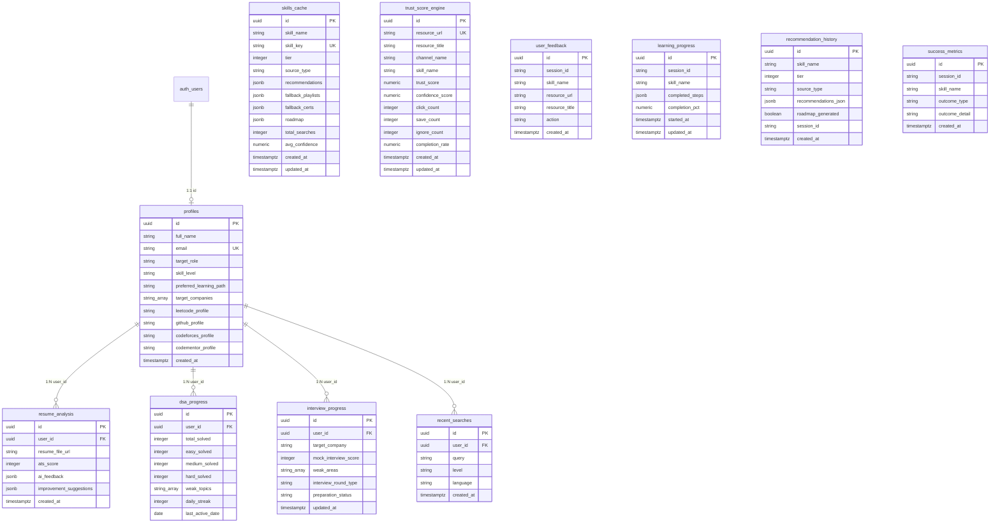
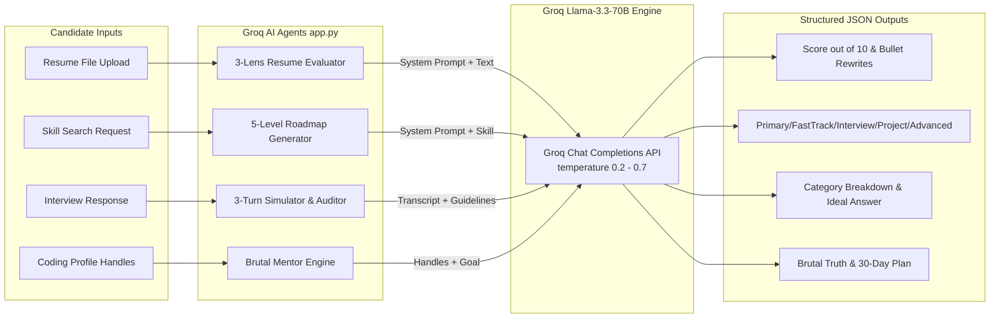

# PRODUCT_CONTEXT.md — SkillPath Technical Handoff & Architecture Blueprint

> **Notice**: This document serves as an exhaustive, self-contained technical handoff for Senior Software Architects, Principal Engineers, and AI Agents. Every statement in this document is derived directly from the source code of the **SkillPath (AI-CATALYST)** repository.

---

## 1. Product Overview

- **Product Name**: SkillPath — Enterprise AI Career Accelerator (Repository: `AI-CATALYST`)
- **Vision**: To provide an enterprise-grade, AI-driven career readiness platform that systematically accelerates technical candidates toward placement readiness at FAANG and top-tier technology companies.
- **Problem Statement**: Technical job seekers struggle with fragmented preparation tools: generic learning roadmaps, ineffective ATS resume checkers, unguided DSA practice across 500+ LeetCode problems, and a lack of realistic mock interview evaluations.
- **Target Users**:
  - Computer Science students and engineering candidates preparing for internships and full-time tech roles (L3/L4/L5 benchmarks).
  - Software engineers transitioning into specialized tech domains (Backend, System Design, AI/ML, Fullstack).
- **Core Value Proposition**:
  - **Hyper-Personalized AI Career Roadmaps**: Dynamic 5-level curriculum generated via Groq Llama-3.3-70B.
  - **3-Lens Multi-Stage Resume Evaluator**: Simulates ATS parsers, recruiter 6-second skim judgments, and hiring manager technical audits.
  - **DSA Command Center**: Frequency-ranked LeetCode question databases mapped across 663+ global tech enterprises.
  - **AI Mock Interview Simulator**: Interactive multi-turn technical & behavioral interviews with instant SaaS-grade scorecard feedback.
  - **Personal Readiness Index (PRI)**: Weighted multi-variable readiness score combining DSA problem solving, resume compliance, project portfolio, and learning progress.

---

## 2. Features

| Feature Name | Internal Mechanics | Status |
| :--- | :--- | :--- |
| **Hybrid Skill & Certification Router** | Executes a 3-tier lookup algorithm: **Tier 1**: Checks local CSV/JSON cache for instant offline match; **Tier 2**: Queries YouTube Data API v3 for top-rated playlists with local trust scoring; **Tier 3**: Triggers Groq Llama-3.3-70B for niche subjects, structuring response into 5 levels (Primary, Fast Track, Interview, Project, Advanced). | **Complete** |
| **Multi-Stage Resume Evaluator** | Extracts text from uploaded PDF/DOCX via `pypdf` & `docx2txt`. Sends raw text to Groq LLM with a 3-lens evaluation prompt (ATS Keyword Match %, Recruiter 6-sec Judgment, Hiring Manager Technical Depth Audit). Generates numerical score (0-10), verdict, line-by-line bullet rewrites, and rejection risk flags. | **Complete** |
| **DSA Command Center & LeetCode DB** | Loads pre-indexed CSV databases covering 663+ companies and 3,310 unique LeetCode problems. Supports difficulty filters (Easy/Medium/Hard), status tracking (Pending/Completed), and syncs completed items to Supabase `dsa_progress`. | **Complete** |
| **Live LeetCode Stats Fetcher** | Queries LeetCode's public GraphQL API (`https://leetcode.com/graphql`) to fetch live solved counts (`all`, `easy`, `medium`, `hard`) and user stats given a handle. | **Complete** |
| **Mock Interview Simulator** | 3-stage interactive simulator. Initializes candidate parameters (Role, Round Type, Benchmark Level), generates dynamic 3-turn question sequences via Groq LLM, parses code/text responses, and produces a structured final evaluation report. | **Complete** |
| **Brutal AI Mentor Mode** | Dual-mode AI advisory tool. **Career Mode**: Evaluates user goals against current skills to output unfiltered critique; **Coding Standing Mode**: Aggregates handles (LeetCode, GitHub, Codeforces, Codementor) to generate a 30-day action plan. | **Complete** |
| **Personal Readiness Index (PRI)** | Calculates a real-time mathematical score based on formula: $\text{PRI} = (\text{DSA} \times 0.40) + (\text{Resume} \times 0.30) + (\text{Playlist} \times 0.15) + (\text{Projects} \times 0.15)$. | **Complete** |
| **Student Project Showcase** | Allows candidates to manage portfolio project blueprints. Supports CRUD operations synced to Supabase `profiles` / `user_feedback`. | **Complete** |
| **Tracked Active Roadmap** | Enables candidates to select an AI-generated roadmap and track checklist completion steps, updating progress bars on the main Dashboard. | **Complete** |
| **GitHub-Style Heatmap & Streak Widget** | Visualizes daily practice activity and consecutive learning streaks via HTML5 Canvas sparklines and SVG graphs. | **Complete** |
| **Supabase Authentication & Route Guard** | Client-side SPA route guard checks `localStorage` for `sb-*-auth-token`. Backend validates Bearer JWT tokens on protected endpoints using Supabase Auth. | **Complete** |

---

## 3. Tech Stack

| Layer | Technology | Purpose / Details |
| :--- | :--- | :--- |
| **Frontend UI** | HTML5, CSS3, Vanilla JavaScript (ES6+) | Single-Page Application (SPA) with Nebula Glassmorphic Design System. No heavy JS frameworks. |
| **Charting Engine** | Chart.js (CDN v4) | Renders Competency Radar Graphs, Skill Distribution Doughnuts, and Consistency Progress Charts. |
| **Backend Framework** | Python 3.9+ · Flask 3.0+ | REST API gateway, static file server, middleware routing, and service layer coordinator. |
| **Database** | Supabase (PostgreSQL 15) | Relational database hosting 11 tables with Indexes, Triggers, and Row-Level Security (RLS). |
| **Authentication** | Supabase Auth + JWT Bearer Tokens | Stateless authentication model via `token_required` Flask decorator validating JWTs. |
| **Object Storage** | Supabase Storage (`resumes` bucket) | 10MB limit storage bucket configured for candidate resume document uploads (`.pdf`, `.docx`). |
| **AI Inference** | Groq SDK (`llama-3.3-70b-versatile`) | Ultra-high throughput LLM token generation for resume analysis, roadmap creation, and interview simulation. |
| **External APIs** | YouTube Data API v3, LeetCode GraphQL API | Live playlist retrieval and real-time LeetCode profile analytics. |
| **PDF/Doc Parsing** | `pypdf`, `docx2txt` | Server-side text extraction from uploaded resume files. |
| **Deployment Config** | Vercel (`vercel.json`), Local Flask (`app.py`) | Multi-environment deployment targets. |

---

## 4. Project Architecture

SkillPath follows a **Decoupled Client-Server Architecture** featuring a single-page application (SPA) web frontend, a stateless Flask REST Gateway, a remote PostgreSQL database on Supabase, and a cloud-scale LLM inference engine via Groq.



### Request Flow Sequence (Resume Analysis & AI Roadmap)



---

## 5. Folder Structure

```
AI-CATALYST/
├── app.py                      # Core Flask API Gateway, AI Orchestrator & Controller
├── requirements.txt            # Python dependencies (Flask, Supabase, Groq, pandas, etc.)
├── .env                        # Local Environment Variables & Secrets (git-ignored)
├── .gitignore                  # Git Exclusion Rules (.env, __pycache__, venv)
├── README.md                   # High-Level Repository Documentation
├── vercel.json                 # Vercel Deployment & Routing Configuration
│
├── static/                     # Single Page Application (SPA) Web Assets
│   ├── index.html              # Main Control Dashboard SPA (Nebula Design System)
│   ├── login.html              # Glassmorphic Sign-In / Sign-Up Interface
│   ├── css/
│   │   └── style.css           # Global CSS Variables, Nebula Tokens & Responsive Layouts
│   └── js/
│       ├── app.js              # Primary SPA Frontend Orchestrator & Event Controller
│       └── supabaseClient.js   # Supabase Client Singleton & Dynamic Fetch Interceptor
│
├── supabase/                   # Database Infrastructure & Schemas
│   ├── consolidated_schema.sql # Unified master SQL setup script (Tables, Triggers, RLS)
│   ├── config.toml             # Supabase Infrastructure & Local Dev Config
│   └── migrations/             # Incremental SQL migration scripts
│       ├── 20240501000000_initial_schema.sql
│       ├── 20240501000001_rls_policies.sql
│       ├── 20240501000002_storage_setup.sql
│       ├── 20240501000003_recent_searches.sql
│       ├── 20240502000000_ai_engine_tables.sql
│       └── 20260616000000_coding_profiles.sql
│
└── data/                       # Pre-Packaged Data Pipelines & Local Knowledge Datasets
    ├── certifications/         # Static datasets of professional credentials (.csv)
    ├── leetcode-companywise/   # CSV databases of company-specific questions (663+ folders)
    └── *.csv                   # Fallback YouTube playlist configurations by domain
```

---

## 6. Backend (API Reference)

All endpoints below reside in `app.py`. Protected endpoints require header `Authorization: Bearer <token>`.

### Endpoint Directory (31 Endpoints)

| Method | Route | Auth Required | Purpose |
| :--- | :--- | :--- | :--- |
| `GET` | `/` | No | Serves `static/index.html` |
| `GET` | `/login-page` | No | Serves `static/login.html` |
| `GET` | `/config` | No | Exposes public `SUPABASE_URL` and `SUPABASE_ANON_KEY` to client JS |
| `GET` | `/logout` | No | Redirects to `/login-page` |
| `POST` | `/analyze-resume` | Yes | Unpacks PDF/DOCX, executes 3-Lens Groq evaluation, saves to `resume_analysis` |
| `POST` | `/get-resource` | No | Tiered skill router (CSV -> YouTube API -> Groq AI Roadmap) |
| `POST` | `/track-click` | No | Increments click/save/complete analytics in `user_feedback` & `trust_score_engine` |
| `POST` | `/mentor-mode` | No | Executes Brutal AI Mentor critique (Career or Coding profiles) |
| `GET` | `/get-playlist-videos` | No | Fetches itemized video list for a YouTube playlist |
| `GET` | `/get-companies` | No | Returns sorted list of 663+ supported LeetCode company names |
| `GET` | `/get-questions` | No | Returns frequency-ranked LeetCode problems for a selected company |
| `GET` | `/get-user-session` | Yes | Validates session token and returns active user metadata & target role |
| `GET` | `/get-latest-resume` | Yes | Retrieves latest resume analysis record for authenticated user |
| `POST` | `/sync-dsa-progress` | Yes | Persists solved DSA question list to `dsa_progress` |
| `GET` | `/get-dsa-progress` | Yes | Fetches solved DSA questions array for authenticated user |
| `GET` | `/get-leetcode-stats` | No | Queries LeetCode's public GraphQL API for user profile statistics |
| `POST` | `/save-coding-profiles`| Yes | Updates candidate handles (`leetcode`, `github`, `codeforces`, `codementor`) in `profiles` |
| `POST` | `/sync-user-projects` | Yes | Saves array of student portfolio projects to `profiles.target_companies` / metadata |
| `GET` | `/get-user-projects` | Yes | Retrieves student portfolio project list |
| `POST` | `/sync-saved-playlists`| Yes | Saves user's bookmarked YouTube playlists |
| `GET` | `/get-saved-playlists` | Yes | Retrieves user's bookmarked YouTube playlists |
| `POST` | `/sync-active-roadmap` | Yes | Persists currently tracked AI roadmap and completed checklist steps |
| `GET` | `/get-active-roadmap` | Yes | Retrieves active roadmap state from `learning_progress` |
| `POST` | `/add-milestone` | Yes | Records an earned candidate milestone achievement |
| `GET` | `/get-milestones` | Yes | Fetches list of earned candidate milestones |
| `POST` | `/generate-competency-audit` | Yes | Executes LLM evaluation to generate a comprehensive Career Competency Audit |
| `GET` | `/get-competency-audit` | Yes | Retrieves latest saved Competency Audit |
| `POST` | `/generate-mock-interview` | Yes | Initializes a mock interview session and generates Question 1 |
| `POST` | `/respond-mock-interview` | Yes | Processes candidate response turn and generates follow-up question |
| `POST` | `/evaluate-mock-interview` | Yes | Evaluates full 3-turn interview transcript and generates final scorecard |
| `GET` | `/get-interview-history` | Yes | Retrieves past mock interview audit logs from `interview_progress` |

---

## 7. Database Architecture

The database is built on **Supabase (PostgreSQL 15)**. The schema is defined in [supabase/consolidated_schema.sql](file:///c:/PROJECTS/SKiLL%20PATH%20GIT/AI-CATALYST/supabase/consolidated_schema.sql).

### Entity Relationship Diagram



### Table Definitions & Index Summary

1. `profiles`: Primary candidate metadata, target roles, and external handles (`leetcode_profile`, `github_profile`, `codeforces_profile`, `codementor_profile`). Indexed on `email`.
2. `resume_analysis`: Historical ATS & LLM resume evaluation outputs. Composite index on `(user_id, created_at DESC)`.
3. `dsa_progress`: Candidate problem solving stats & streaks. Indexed on `user_id`.
4. `interview_progress`: Mock interview audit logs & scores. Composite index on `(user_id, target_company)`.
5. `recent_searches`: Log of user searches. Indexed on `created_at DESC`.
6. `skills_cache`: Tier-1 memory cache for AI roadmaps and recommendations. Unique index on `skill_key`.
7. `trust_score_engine`: Feedback-based resource quality scoring engine. Unique index on `resource_url`.
8. `user_feedback`: Interaction logs (`click`, `save`, `ignore`, `complete`, `roadmap_view`). Indexed on `skill_name`, `resource_url`, `action`.
9. `learning_progress`: Tracks active AI roadmaps. Unique constraint on `(session_id, skill_name)`.
10. `recommendation_history`: Audit trail of AI recommendations.
11. `success_metrics`: Placement and completion outcomes.

### Database Triggers & Automations
- **Timestamp Updates**: `update_updated_at()` and `update_modified_column()` automatically set `updated_at = NOW()` on `skills_cache`, `trust_score_engine`, `learning_progress`, and `interview_progress`.
- **Auto Profile Creation**: Trigger `on_auth_user_created` calls function `public.handle_new_user()` on `auth.users` insertion to automatically provision a corresponding record in `public.profiles`.

### Storage Bucket Configuration
- **Bucket**: `resumes` (Private, 10MB limit, allowed MIMEs: PDF, DOC, DOCX).
- **Storage Policies**: RLS policies restrict file access such that authenticated users can only insert, select, update, or delete files stored under their own folder path (`resumes/<user_id>/<filename>`).

---

## 8. Authentication & Authorization

- **Auth Framework**: Supabase Auth (stateless JWTs).
- **Sign In / Sign Up**: Executed on client side in `static/login.html` calling `supabaseClient.auth.signInWithPassword()` or `signUp()`.
- **Session Storage**: Supabase SDK automatically persists session tokens in `localStorage` under key `sb-<project_ref>-auth-token`.
- **Middleware Validation**: Flask endpoint decorator `token_required` in `app.py`:
  1. Extracts `Authorization: Bearer <token>` header.
  2. Calls `supabase.auth.get_user(token)` using the service role client.
  3. Attaches validated user object to Flask request context (`g.user`, `g.user_id`, `g.user_email`).
  4. Returns `HTTP 401 Unauthorized` if token is missing or invalid.
- **Route Guard**: Inline script in `static/index.html` checks `localStorage` for `sb-*-auth-token`. If missing, redirects browser to `/login-page`.

---

## 9. AI Architecture

The system uses the **Groq API** with the `llama-3.3-70b-versatile` model across 4 primary AI engines in `app.py`:



### Fallback & Ranking System
- **Tier 1 (Instant Local Match)**: Checks `skills_cache` and static CSV datasets in `data/`. If found, returns in < 50ms without invoking paid APIs.
- **Tier 2 (YouTube API + Trust Scoring)**: If Tier 1 misses, queries YouTube Data API v3. Results are dynamically ranked using the formula:
  $$\text{Score} = (\text{ClickCount} \times 1.0) + (\text{SaveCount} \times 2.0) - (\text{IgnoreCount} \times 1.5) + (\text{CompletionRate} \times 0.5)$$
- **Tier 3 (Groq LLM Generation)**: If niche skill, invokes Groq LLM to generate a structured 5-level curriculum, caching the output in `skills_cache` for future users.

---

## 10. External Integrations

1. **Groq API**:
   - **Purpose**: High-speed AI inference for resume evaluation, roadmap generation, mentor critique, and mock interviews.
   - **Auth**: `GROQ_API_KEY` via SDK (`from groq import Groq`).
2. **YouTube Data API v3**:
   - **Purpose**: Fetching real-time video learning playlists and itemized video metadata.
   - **Auth**: `YOUTUBE_API_KEY` passed as query parameter.
3. **LeetCode Public GraphQL API**:
   - **Purpose**: Scraping candidate problem-solving stats (`all`, `easy`, `medium`, `hard`).
   - **Auth**: None (Public GraphQL endpoint `https://leetcode.com/graphql`).
4. **Supabase REST & Auth APIs**:
   - **Purpose**: User authentication, relational data persistence, and object storage.
   - **Auth**: Bearer JWTs, `SUPABASE_ANON_KEY`, `SUPABASE_SERVICE_KEY`.

---

## 11. Business Logic Workflows

### 1. Resume Analysis Workflow
1. Client posts PDF/DOCX file to `/analyze-resume`.
2. Flask extracts text using `pypdf.PdfReader` or `docx2txt.process`.
3. Text is formatted into a 3-lens system prompt (ATS Parser, Recruiter 6-sec Judgment, Hiring Manager Audit).
4. Groq generates a strict JSON payload.
5. Record is persisted to Supabase `resume_analysis` table.
6. JSON returned to client; SPA updates Resume Score and Personal Readiness Index.

### 2. Personal Readiness Index (PRI) Workflow
1. SPA aggregates candidate variables:
   - **DSA Score**: Percentage of target LeetCode problems solved or live LeetCode stats.
   - **Resume Score**: Latest ATS score out of 100.
   - **Playlist Progress**: Percentage of saved learning videos completed.
   - **Projects Score**: Number of verified student projects (capped at 5).
2. Calculates: $\text{PRI} = (\text{DSA} \times 0.40) + (\text{Resume} \times 0.30) + (\text{Playlist} \times 0.15) + (\text{Projects} \times 0.15)$.
3. Updates Radar Graph and readiness verdict on Dashboard.

---

## 12. Frontend Architecture

- **Architecture**: Single Page Application (SPA) inside `static/index.html` managed by `static/js/app.js`.
- **View Navigation**: Tabs use `data-view` attributes (`view-dashboard`, `view-learning`, `view-practice`, `view-resume`, `view-interviews`, `view-mentor`, `view-projects`, `view-analytics`, `view-settings`).
- **Fetch Interceptor**: `static/js/supabaseClient.js` intercepts all `window.fetch()` calls to inject `Authorization: Bearer <access_token>` from `supabaseClient.auth.getSession()`.
- **Design System**: **Nebula Design Tokens** defined in `static/css/style.css` (Glassmorphic cards, HSL tailwind-inspired colors, dark mode support).

---

## 13. Security Assessment

- **Authentication**: Stateless JWT validation via Supabase Auth.
- **Authorization**: Flask `@token_required` decorator enforces token presence on sensitive endpoints.
- **Secrets Management**: Secrets stored in `.env` (`SUPABASE_SERVICE_KEY`, `GROQ_API_KEY`, `YOUTUBE_API_KEY`).
- **Known Security Risks**:
  1. **Permissive RLS Policies**: Policies in `consolidated_schema.sql` currently use `FOR ALL USING (true) WITH CHECK (true)`, allowing any client with the `anon` key to query or modify all table rows.
  2. **Public Config Exposure**: Endpoint `/config` returns `SUPABASE_ANON_KEY` to client JS. (Standard for Supabase, but requires strict RLS).
  3. **Lack of Rate Limiting**: API routes lack rate limiting (e.g. `Flask-Limiter`), exposing `/analyze-resume` and `/generate-mock-interview` to potential Groq API credit depletion attacks.

---

## 14. Performance & Bottlenecks

- **Optimizations**:
  - In-memory pre-indexing of 3,310 LeetCode problems on startup.
  - Multithreaded execution using `ThreadPoolExecutor` for batch tasks.
  - SQL Indexes on `email`, `skill_key`, `user_id`, `created_at`.
- **Bottlenecks**:
  - Synchronous LLM calls: Groq requests (~1-3s) block Flask worker threads.
  - Large file parsing: Parsing 10MB PDFs synchronously in HTTP request loop.

---

## 15. Deployment Configuration

- **Hosting Target**: Compatible with Vercel, Render, AWS Elastic Beanstalk, or Docker containers.
- **Vercel Config** (`vercel.json`):
  ```json
  {
    "version": 2,
    "builds": [{ "src": "app.py", "use": "@vercel/python" }],
    "routes": [{ "src": "/(.*)", "dest": "app.py" }]
  }
  ```
- **Environment Variables Required in Production**:
  - `SECRET_KEY`
  - `SUPABASE_URL`
  - `SUPABASE_ANON_KEY`
  - `SUPABASE_SERVICE_KEY`
  - `GROQ_API_KEY`
  - `YOUTUBE_API_KEY`

---

## 16. Current Status Matrix

| Component | Status | Notes |
| :--- | :--- | :--- |
| Supabase Relational Schema | **100% Complete** | All 11 tables active and verified on live Supabase instance. |
| Groq AI Integration | **100% Complete** | Resume, Mentor, Interview, and Roadmap agents verified. |
| LeetCode Company Mapping | **100% Complete** | 663 companies and 3,310 problems indexed and searchable. |
| Supabase Auth & JWT Middleware| **100% Complete** | Sign-in, sign-up, session persistence, and Bearer token check active. |
| YouTube API Integration | **100% Complete** | Real-time playlist retrieval and trust score engine operational. |
| Strict Row-Level Security | **Pending** | RLS enabled but currently using permissive `USING (true)` dev policies. |
| Production WSGI Server | **Pending** | Running on Flask development server (`app.run(debug=True)`). |

---

## 17. Future Roadmap

### Short-Term
- Implement strict RLS policies restricting row access to `auth.uid() = user_id`.
- Add `Flask-Limiter` rate limiting on AI endpoints (`/analyze-resume`, `/generate-mock-interview`).
- Integrate Celery / Redis background queue for async resume processing.

### Long-Term
- Multi-modal resume analysis (parsing visual layout, alignment, and formatting).
- Real-time voice-based mock interviews using WebRTC & Speech-to-Text.
- Enterprise recruiter portal for company hiring managers.

---

## 18. Code Quality & Architectural Review

| Category | Score | Evaluation & Observations |
| :--- | :---: | :--- |
| **Architecture** | **8 / 10** | Well-decoupled SPA + Flask Gateway + Cloud DB architecture. |
| **Database** | **8 / 10** | Comprehensive relational schema, triggers, and automated profile creation. |
| **Backend** | **7 / 10** | Monolithic `app.py` (2,300+ lines). Should be refactored into Flask Blueprints. |
| **Frontend** | **8 / 10** | High-performance vanilla JS without heavy bundle overhead. Clean design tokens. |
| **Security** | **5 / 10** | Permissive RLS policies (`USING (true)`) must be hardened before production. |
| **Scalability** | **6 / 10** | Synchronous AI calls and single-file Flask gateway present bottlenecks under high load. |
| **Maintainability** | **7 / 10** | Clear helper functions, but needs Modular Blueprint split. |

---

## 19. Missing Production Features

Before deploying to a public production environment, the following must be implemented:
1. **Strict RLS Policies**: Replace `USING (true)` with `auth.uid() = user_id`.
2. **Modular Flask Blueprints**: Split `app.py` into separate route modules (`routes/auth.py`, `routes/resume.py`, `routes/interview.py`).
3. **Production WSGI Application Server**: Run behind `Gunicorn` or `uWSGI` with Nginx reverse proxy.
4. **API Rate Limiting**: Add rate limiting to prevent API key quota exhaustion.
5. **CORS Hardening**: Restrict CORS headers from `CORS(app)` to explicit domain origins.

---

## 20. Architectural Recommendations (CTO Guidelines)

If redesigning this platform for enterprise scale:
1. **Refactor Monolith into Flask Blueprints**: Divide `app.py` into modular blueprints (`auth`, `resume`, `practice`, `interviews`, `mentor`).
2. **Harden Database Row-Level Security**: Update Postgres policies so candidates can only access their own records.
3. **Asynchronous Processing for Heavy AI Operations**: Use task queues (e.g. Celery / RQ) for resume parsing and multi-turn interview evaluations.
4. **Redis Caching for LeetCode Stats**: Cache external GraphQL responses in Redis with a 24-hour TTL to eliminate rate limit risks.
