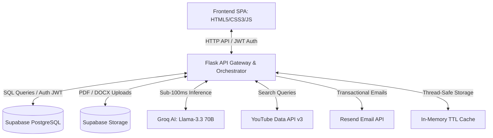
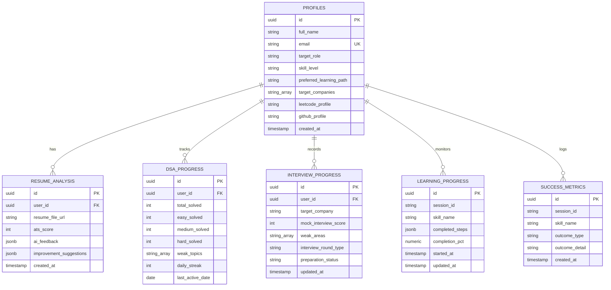

# 🛰️ SkillPath — Enterprise AI Career Accelerator

SkillPath is a high-performance, SaaS-style career readiness platform designed to accelerate candidate readiness for FAANG and top-tier technology companies. By orchestrating multi-agent LLM systems, local curated learning pathways, and cloud-scale database operations, SkillPath offers hyper-personalized roadmap extraction, resume assessment, algorithmic practice metrics, mock interview targeting, and automated transactional email reporting.

---

<p align="center">
  <a href="https://www.python.org/">
    
  </a>
  <a href="https://flask.palletsprojects.com/">
    
  </a>
  <a href="https://supabase.com/">
    
  </a>
  <a href="https://groq.com/">
    
  </a>
  <a href="https://resend.com/">
    
  </a>
  <a href="https://opensource.org/licenses/MIT">
    
  </a>
</p>

---

## 🏗️ System Architecture

SkillPath is built on a decoupled client-server architecture backed by a scalable SQL persistence layer, high-throughput AI inference engine, and asynchronous email notification pipelines.



1. **SPA Frontend**: Single-page application UI with a glassmorphic dashboard (Nebula Design System), using Chart.js for radar charts and progress history.
2. **Flask API Gateway**: Handles REST requests, JWT authentication middleware, in-memory TTL caching, and background task execution via `ThreadPoolExecutor`.
3. **Supabase Cloud**: Manages user authentication, profile data, DSA progress tracking, resume evaluations, and database Row-Level Security (RLS).
4. **Groq AI Engine**: Evaluates resume transcripts, grades ATS keyword density, constructs personalized skill roadmaps, and conducts mock interviews using `llama-3.3-70b-versatile`.
5. **Resend Email Service**: Sends automated welcome emails and personalized career report PDF/HTML summaries to candidates.

---

## 🌟 Core Pillars

### 1. Hybrid Skill & Certification Router
- **Tier-1 Local Cache**: Instantly maps core topics (Python, Java, System Design, DSA) using pre-packaged, validated local datasets.
- **Tier-2 YouTube Playlists Fallback**: Fetches real-time learning playlists via YouTube Data API v3 with custom quality metrics.
- **Tier-3 AI Recommendation Engine**: Uses Llama-3.3 70B via Groq to craft personalized 5-tier roadmaps: *Primary, Fast Track, Interview, Project, and Advanced*.

### 2. Multi-Stage Resume Evaluator
- **Parsing Suite**: Extracts formatted text from PDF (`pypdf`) and DOCX (`docx2txt`) uploads.
- **Recruiter Sandbox Simulation**:
  - **ATS Scanner**: Keyword density analysis and structural parsing verification.
  - **Recruiter 6-Second Review**: Rapid highlight and impact audit.
  - **Hiring Manager Audit**: Technical depth and project complexity grading.
- **Actionable Output**: Delivers scores out of 10, tailored project ideas, suggested tools, line-by-line bullet points rewrites, and email export capability.

### 3. DSA Command Center & Performance Analytics
- **Company-wise Question Mappings**: Frequency-sorted problem sets for 100+ tech companies (e.g. Google, Amazon, Meta, Microsoft, Apple).
- **GitHub-Style Heatmap**: Visualizes practice streak consistency and topic completion over time.
- **Personal Readiness Index (PRI)**: Weighted multi-variable readiness score:
  $$\text{PRI} = (\text{DSA\_Score} \times 0.40) + (\text{Resume\_Score} \times 0.30) + (\text{Playlist\_Progress} \times 0.15) + (\text{Projects\_Score} \times 0.15)$$
- **Competency Radar**: Automatically benchmarks candidates against target role baselines (Intern, L3, L4, L5, Senior).

### 4. Interactive AI Mock Interview & Evaluation
- **Simulated Interview Rounds**: AI-generated technical questions based on candidate target role and company.
- **Real-Time Scoring & Feedback**: Evaluates technical precision, communication style, and structural clarity.

### 5. Automated Email Reporting & Onboarding
- **Welcome Emails**: Automatic asynchronous welcome email dispatch upon candidate onboarding.
- **Career Reports**: One-click email dispatch of resume audit and interview feedback directly to candidate inbox via Resend.

---

## 🛠️ Technology Stack

| Layer | Technology | Purpose |
| :--- | :--- | :--- |
| **Backend Framework** | [Python 3.9+](https://www.python.org/) · [Flask 3.0+](https://flask.palletsprojects.com/) | REST API development, routing, and task orchestration. |
| **AI Inference** | [Groq SDK](https://groq.com/) (`llama-3.3-70b-versatile`) | Ultra-fast token generation for resume analysis and mock interviews. |
| **Database & Storage** | [Supabase](https://supabase.com/) (PostgreSQL 15) | Relational database, Supabase Auth, Object storage, and RLS policies. |
| **Email Service** | [Resend API](https://resend.com/) | Transactional email dispatch for onboarding and career audit reports. |
| **Authentication** | Supabase Auth + JWT Bearer Tokens | Stateless JWT-based authentication middleware. |
| **Frontend UI** | HTML5 · Vanilla CSS3 · JS (ES6+) | Responsive glassmorphic dark-mode interface dashboard. |
| **Performance & Caching**| Thread-Safe In-Memory TTL Cache | High-speed response caching for API endpoints and metadata. |
| **Document Processing**| `pypdf` · `docx2txt` | Extract text content from candidate resume file uploads. |

---

## 📁 Repository Directory Structure

```text
AI-CATALYST/
├── app.py                      # Flask API Gateway, AI Orchestrator & Route Handlers
├── requirements.txt            # Python environment dependencies
├── .env                        # System Environment & Secret Configurations (git-ignored)
├── .gitignore                  # Git Ignore Rules
├── README.md                   # Project Documentation
├── vercel.json                 # Vercel Deployment Configuration
├── PRODUCT_CONTEXT.md          # Comprehensive Product Specifications & Roadmap
│
├── backend/                    # Core Backend Services & Utilities
│   ├── services/
│   │   └── welcome_service.py  # User Onboarding & Email Dispatch Service
│   └── utils/
│       └── email_service.py    # Resend API Transactional Email Utilities
│
├── static/                     # Single Page Application (SPA) Frontend
│   ├── login.html              # Glassmorphic Login & User Registration UI
│   ├── index.html              # Central Career Dashboard SPA
│   ├── css/
│   │   └── style.css           # Custom CSS Design System & Layout Tokens
│   └── js/
│       ├── app.js              # SPA Application Logic & API Communications
│       └── supabaseClient.js   # Supabase Authentication & Client Wrapper
│
├── supabase/                   # Supabase Infrastructure & Database Provisioning
│   ├── consolidated_schema.sql # Complete SQL Schema script (Tables, Triggers, RLS)
│   ├── config.toml             # Local Supabase configuration
│   └── migrations/             # Local database migration history
│
└── data/                       # Curated Learning & Company Question Datasets
    ├── leetcode-companywise/   # CSV databases of company-specific DSA problems
    ├── certifications/         # Static database of tech certifications
    └── *.csv                   # YouTube playlist & course databases
```

---

## 🚀 Getting Started

### 1. Prerequisites
- **Python 3.9+** installed on your system.
- A **Supabase** project (URL and API Keys).
- A **Groq API Key** for LLM inference.
- *(Optional)* A **Resend API Key** for email dispatch features.

### 2. Clone and Setup Environment
```bash
git clone https://github.com/P-adithyagoud/AI-CATALYST.git
cd AI-CATALYST

# Initialize virtual environment
python -m venv venv

# Activate virtual environment
# Windows:
venv\Scripts\activate
# macOS/Linux:
source venv/bin/activate

# Install required dependencies
pip install -r requirements.txt
```

### 3. Environment Variables Configuration
Create a `.env` file in the root directory:
```env
# Flask Configuration
SECRET_KEY=skillpath-dev-secret-key-2024
PORT=3000

# Supabase API Credentials
SUPABASE_URL=https://your-project.supabase.co
SUPABASE_ANON_KEY=your_anon_key_here
SUPABASE_SERVICE_KEY=your_service_role_key_here

# Groq AI Engine API Key
GROQ_API_KEY=gsk_your_groq_api_key_here

# Resend API Key (Optional for email notifications)
RESEND_API_KEY=re_your_resend_api_key_here

# YouTube Data API Key (Optional for search fallback)
YOUTUBE_API_KEY=your_youtube_api_key_here
```

### 4. Setup Database Schema
1. Log in to your [Supabase Dashboard](https://supabase.com).
2. Go to **SQL Editor** -> **New Query**.
3. Open `supabase/consolidated_schema.sql` from this repository, copy its contents, and paste them into the SQL Editor.
4. Click **Run** to execute the script and provision all necessary tables, triggers, indexes, and storage buckets.

### 5. Run the Application
```bash
python app.py
```
By default, the server will start at:
- **Local Base URL**: [http://localhost:3000](http://localhost:3000)
- **Login Page**: [http://localhost:3000/login-page](http://localhost:3000/login-page)
- **Dashboard**: [http://localhost:3000/dashboard](http://localhost:3000/dashboard)

---

## 🔌 API Reference

Main API endpoints provided by `app.py`:

| Method | Endpoint | Auth Required | Description |
| :--- | :--- | :--- | :--- |
| `POST` | `/signup` | ❌ No | Register a new user profile with Supabase Auth |
| `POST` | `/login` | ❌ No | Authenticate user credentials and return JWT bearer token |
| `GET` | `/login-page` | ❌ No | Serves the login and signup frontend HTML page |
| `GET` | `/dashboard` | ❌ No | Serves the main application dashboard HTML page |
| `POST` | `/get-resource` | ✅ Yes | Retrieve skill path roadmaps and recommended learning resources |
| `POST` | `/analyze-resume` | ✅ Yes | Parse PDF/DOCX resume file and return AI ATS evaluation |
| `GET` | `/get-companies` | ✅ Yes | Get list of available tech companies for DSA prep |
| `GET` | `/get-questions` | ✅ Yes | Fetch frequency-sorted LeetCode questions by company/topic |
| `POST` | `/generate-competency-audit` | ✅ Yes | Generate AI-driven career readiness report and audit |
| `POST` | `/send-email-report` | ✅ Yes | Send candidate resume/audit report via Resend email service |
| `POST` | `/send-welcome-email` | ✅ Yes | Trigger welcome email notification for new candidate |
| `POST` | `/sync-user-projects` | ✅ Yes | Persist candidate project portfolio updates to Supabase |
| `POST` | `/sync-active-roadmap` | ✅ Yes | Save interactive roadmap checklist progress |

*Note: Endpoints requiring authorization expect a JWT token in the header:*
`Authorization: Bearer <your_supabase_jwt>`

---

## 🗄️ Database Architecture

Below is the entity-relationship model defining user profiles, resume feedback, and learning progress tracking.



---

## 🤝 Contribution Guidelines

We welcome contributions! To maintain code quality and stability:

1. **Fork** the repository and create a feature branch: `git checkout -b feature/YourFeatureName`.
2. Follow standard **PEP 8** coding guidelines for Python.
3. Test your changes locally on port 3000 before opening a pull request.
4. Open a **Pull Request** detailing your changes and features added.

---

## 📄 License

Distributed under the **MIT License**. See `LICENSE` for details.

---

<p align="center">
  <i>Built with ❤️ for candidate success and career acceleration.</i>
</p>
